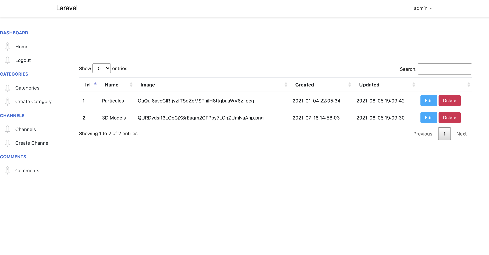

# Backend Simple Twitch (En desarrollo)

**Descripción:** Panel y API de plataforma basaba en canales para mostrar videos y modelos 3D.

<p align="center">

</p>

**Características**:
* Panel (No disponible para ver): https://backend-simple-twitch.oscarcatarigutierrez.com
* API:

Ejemplo: https://backend-simple-twitch.oscarcatarigutierrez.com/api/categories
 ```
| GET|HEAD  | api/categories                      
| POST      | api/categories                      
| GET|HEAD  | api/categories/name/{category_name} 
| GET|HEAD  | api/categories/{category}           
| PUT|PATCH | api/categories/{category}           
| DELETE    | api/categories/{category}           
| GET|HEAD  | api/categories/{name}/channels  
    
| GET|HEAD  | api/channels                        
| POST      | api/channels                        
| GET|HEAD  | api/channels/name/{channel_name}    
*| PUT|PATCH | api/channels/{channel}              
*| DELETE    | api/channels/{channel}              
| GET|HEAD  | api/channels/{channel}  
            
| GET|HEAD  | api/comments                        
| POST      | api/comments                        
| GET|HEAD  | api/comments/name/{channel_name}    
| GET|HEAD  | api/comments/{channel_id}           
| DELETE    | api/comments/{channel_id}           
| GET|HEAD  | api/search/{name}  
 
* Pendiente                
 ```


**Entorno de desarrollo**:
* **Sistema operativo:** macOS BigSur 11.4
* **Vagrant (Homestead):**  2.2.14

